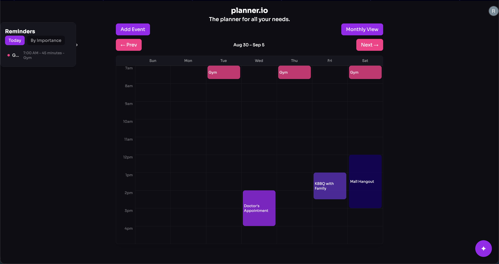

# planner.io

The planner for all your needs.

# Live Demo

# What it does

planner.io is a calendar/planner app that allows you to create and manage your day to day events. The app also includes a built-in AI assistant using Firebase's Gemini 3.5 Flash-Lite Model that can also create, edit, and reschedule events for you. The AI can also detect scheduling conflicts and suggest open times for new events.

# Features

- Weekly and monthly views of events
- Color customizable events including TV Girl or LaLaLand presets
- Reminders panel sorted by today's events or user-set importance
- AI assistant for natural-language event creation, editing, and conflict resolution
- Google Firebase storage saving events through page refreshes (Google Sign-In)
- A little bit of sass 😉

# Built with

- React (Vite) and Tailwind CSS
- Firebase (Firestore, Auth, App Check, AI Logic)

# Why

This is one part of a larger system called "The Iron Man Project". This will optimize workflows by having a personal "Jarvis", or a voice-controlled AI assistant that can access and coordinate several tools to help manage day to day tasks. 